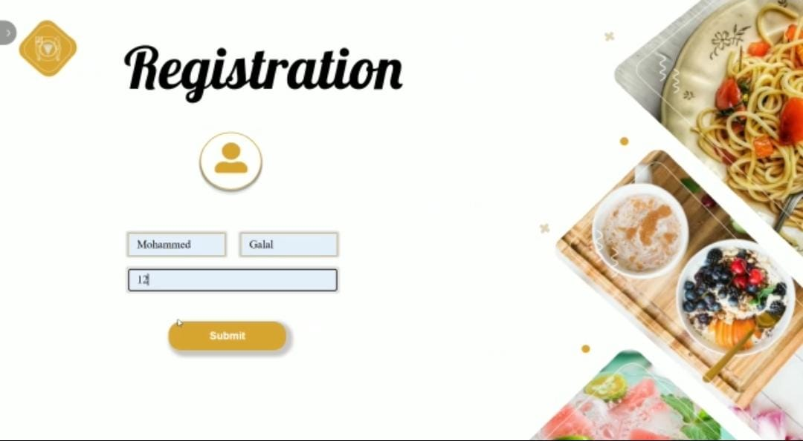
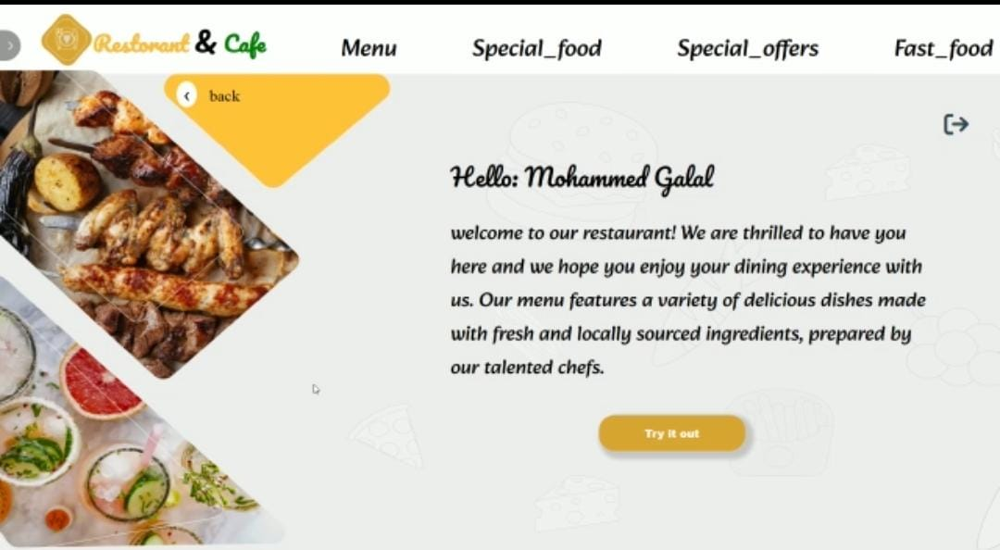
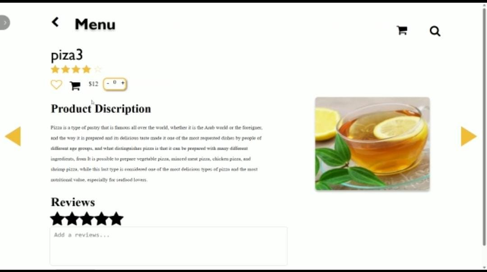
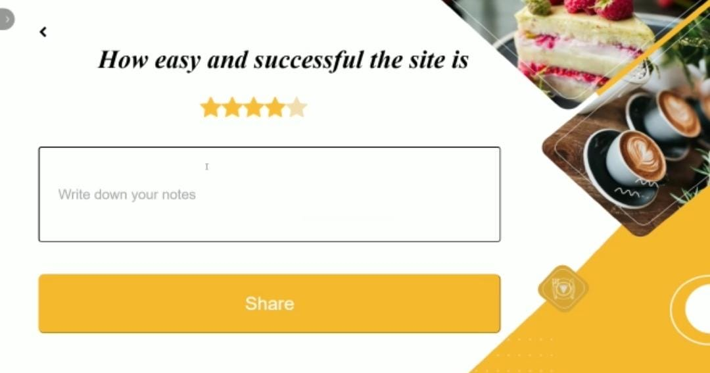

# Restaurant Desktop App

Welcome to the Restaurant Desktop App project! This desktop application, built with .NET MVC framework, serves as a digital menu displayed on tables in restaurants. It provides various features for both customers and restaurant staff, including viewing the menu, checking order execution time, making payments, adding ratings, and managerial capabilities.

## Features
- **Digital Menu:** Display the restaurant's menu items.
- **Order Execution Time:** View estimated time for order execution.
- **Payment Processing:** Enable secure payment transactions.
- **Ratings:** Allow customers to add ratings for menu items and view ratings given by others.
- **Managerial Capabilities:**
  - Manage orders and view total sales.
  - Modify menu items and remove specific dishes.

## Technologies Used
- **Backend:** .NET MVC framework
- **Frontend:** HTML, CSS, JavaScript
- **Database:** SQL

## Installation
1. Clone the repository:
    ```
    git clone https://github.com/Aisha-Hassan1/restaurant-desktop.git
    ```
2. Navigate to the project directory:
3. Open the solution file in Visual Studio.
4. Build and run the project.

## Usage
1. Launch the application.
2. Navigate through the menu items.
3. Place an order and proceed to payment.
4. Add ratings for the dishes.
5. Access managerial features as required.

## Video Demonstration
https://github.com/Aisha-Hassan1/restaurant-desktop/assets/140133347/f7619d62-ec9f-4d35-9953-f90273f3d123


## Screenshots






Feel free to reach out if you have any questions or feedback regarding the Restaurant Desktop App project. Happy dining!
